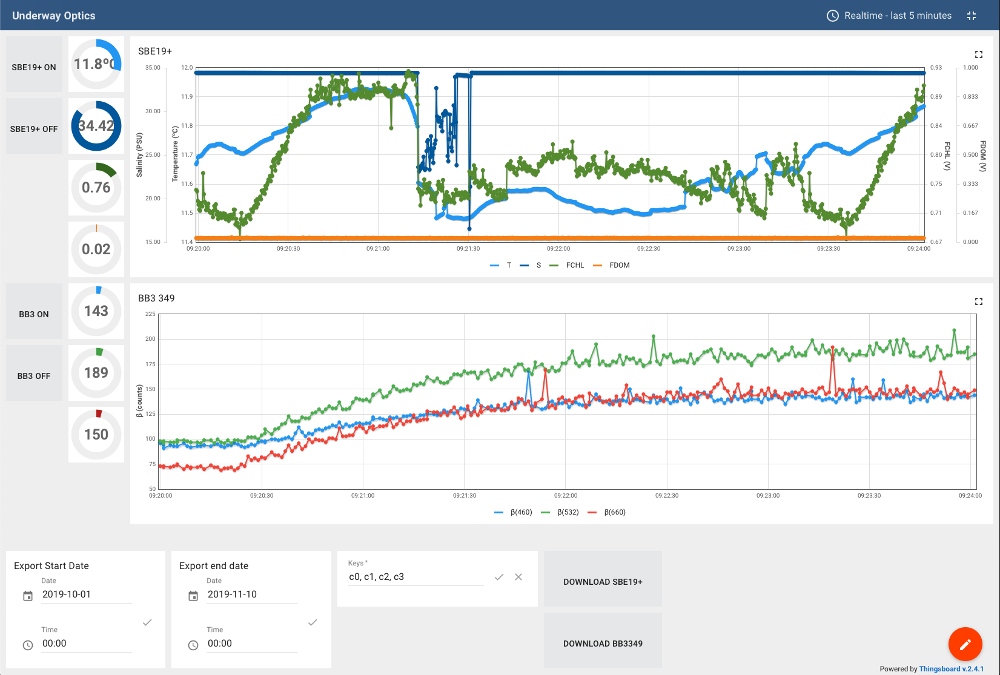

Inlinino V2
-----------

Inlinino V2 is a data logger designed for optical instruments mounted on research vessels continuously measuring the optical properties of the ocean while underway. The second version of Inlinino relies on ThingsBoard, an open-source platform for data collection and visualization, for storage of the data and real-time visualization. The data can now be visualized in real-time by any device with a compatible web browser, connected to the same network as the host of the application. The application is composed of two blocks: a python script receiving the measurements from the instruments, pre-processing the data, and transmitting it via MQTT to ThingsBoard; ThingsBoard stores the data and is used as an interface to control the instruments, visualize the data, and export the data. Inlinino V2 was successfully tested on a Raspberry Pi 3B+ (RPi) with a WetLabs ECO-BB3 and a Sea-Bird SBE19+. The WetLabs ACS sensor is also implemented, the raw data can be logged, however the visualization would overload the RPi, we recommend using a more powerful host if used.

### Getting Started
These instructions will get Inlinino V2 running on a RPi, they can be adjusted for other systems.

#### Prerequisites
We assume that a recent image of [Raspbian Buster Lite](https://www.raspberrypi.org/downloads/raspbian/) is installed on the RPi (instructions for [installing](https://www.raspberrypi.org/documentation/installation/installing-images/README.md), [configuring](https://www.raspberrypi.org/documentation/configuration/raspi-config.md), and [securing](https://www.raspberrypi.org/documentation/configuration/security.md) the RPi)). ThingsBoard (tested with v2.4.1) need to be installed following these [instructions](https://thingsboard.io/docs/user-guide/install/rpi/). Make sure to update the memory settings for slow machine on your RPi. We also recommend updating the max_cpu_time to 1 second.

      sudo vim /etc/thingsboard/conf/thingsboard.yml
      # Replace (line ~406)
          max_cpu_time: "${LOCAL_JS_SANDBOX_MAX_CPU_TIME:100}"
      # By
          max_cpu_time: "${LOCAL_JS_SANDBOX_MAX_CPU_TIME:1000}"
      sudo service thingsboard restart
      
Note that Thingsboard takes up to 2 minutes to start on a RPi.

#### Provision Thingsboard
For Inlinino V2 to work with Thingsboard we first need to setup devices on Thingsboard. Inlinino Core is the device that will communicate with the python script, it allows to start and stop data acquisition for every instrument as well as export the data. Each instrument is then added as a device in Thingsboard. Connect to the instance of Thingsboard installed as a tenant and follow the steps below:

1. Add core device:
    1. Go to Devices > + (bottom left)
    2. Name: RPi
    3. Device type: InlininoCore
    4. Add
2. Set shared attributes of RPi:
    1. Go to Devices > RPi > Attributes > Shared attributes
    2. Add attributes required for export:
        + key=`export_dt_start`, type=String, value="2019-11-10T05:00:00.000Z"
        + key=`export_dt_end`, type=String, value="2019-11-11T05:00:00.000Z"
        + key=`export_keys`, type=String, value="c0, c1, c2"
    3. Add device to log:
        + key=`<device_name>_active`, type=Bool, value=false
        + key=`<device_name>_id`, type=String, value=<device_id>
        + For our example it would be:
            + key=`device1_active`, type=Bool, value=false
            + key=`device1_id`, type=String, value=39028950-002c-11ea-8d67-01952514488a
            + key=`device2_active`, type=Bool, value=false
            + key=`device2_id`, type=Bool, value=7e324a90-f598-11e9-a139-55bd3cee8ac6
3. Add instrument device:
    1. Go to Devices > + (bottom left)
    2. Name: <the name of the device, it can be anything>
        + example: ECO-BB3-349
    3. Device type: supported ECO, ECO-BB3, SBE19+, ACS
        + example: ECO-BB3
    4. Add
4. Set shared attributes of instrument:
    + Attributes common to all device types:
        + key=`serial_port`, type=String, value=\<serial port>
            + to list the serial ports on a RPi `ls /dev/tty*`, they will look like /dev/ttyACM1, /dev/ttyACM2...
        + key=`serial_baudrate`, type=int, value=\<serial baudate>
        + key=`serial_timeout`, type=int, value=\<serial timeout in seconds>
        + key=`bytes_to_read`, type=int, value=\<numbers of bytes to read from serial interface at once>
            + recommend 16 for ECO-BB3 or SBE19+
            + recommend 785 for ACS 
        + key=`registration_bytes`, type=String, value=\<string of hexadecimal code>
            + for sensors outputting ASCII it would be "0d0a" or "0a"
            + for sensors outputting Binary data it's specific to each sensor
                + for the ACS: ff00ff00
        + key=`send_raw`, type=bool, value=\<false | true>
            + recommend false for all ASCII instruments (ECO-BB3, SBE19+) as soon as they are parsed correctly
            + recommend true for all binary instruments (ACS) as they could be an update in the processing
    + Attributes specific to device types ECO, ECO-BB3, and SBE19+:
        + key=`str_separator`, type=String, value=<separator to split string received from instrument>
            + recommend '\t' for ECO-BB3
            + recommend ',' for SBE19+
        + key=`var_columns`, type=String, value=\<columns of interest from string>
            + recommend '3,5,7' for ECO-BB3
            + recommend '0,1,3,4' for SBE19+
        + key=`var_types`, type=String, value=\<variable types within each column>
            + recommend 'int,int,int' for ECO-BB3
            + recommend 'float,float,float,float' for SBE19+
        + key=`expected_n_var`, type=int, value=\<number of parameters after splitting raw string received>
    + Attributes specific to device type ACS: 
        + key=`device_file`, type=String, value=\<path to device file on application host>

For each instrument to log and visualize data, steps 3 and 4 must be repeated. Note that the device id from each instrument added must be copied into the InlininoCore (RPi) device under the attributes `<device_name>_id`. 

An example of dashboard can be provisioned by importing the file `thingsboard_templates/underway_optics.json` into the Dashboard section of Thingsboard.

#### Install Inlinino V2
Download Inlinino V2 code.
 
    wget https://github.com/OceanOptics/Inlinino/archive/tb-app.zip
    unzip tb-app.zip
    cd Inlinino-tb-app
 
To setup the python environment we recommend using virtual environment. Instructions to install miniconda on the RPi.

    wget https://repo.anaconda.com/miniconda/Miniconda3-latest-Linux-armv7l.sh
    bash Miniconda3-latest-Linux-armv7l.sh
    
Setup python environment.

    conda create --name Inlinino python=3
    source activate Inlinino
    python setup.py
    
Update the configuration file with the tenant username, password, and device_id to access the InlininoCore device. 

    cp default_cfg.py Inlinino_cfg.py
    vim Inlinino_cfg.py

#### Start Inlinino V2
Inlinino can be started using python in the correct virtual environment.

    source activate Inlinino
    python Inlinino.py

For long time deployment, we recommend starting Inlinino with nohup or screen.

    nohup python Inlinino.py &>> inlinino.log &

To configure and control the instruments, visualize and export the data, go to the Thingsboard dashboard. 

    http://raspberrypi.local:8080/dashboards/

### Questions and issues
For any questions or issues regarding Inlinino please contact [me](mailto:nils.haentjens+inlinino@maine.edu).
