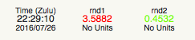
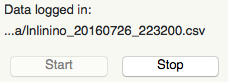
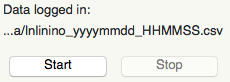
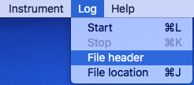
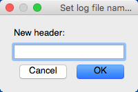
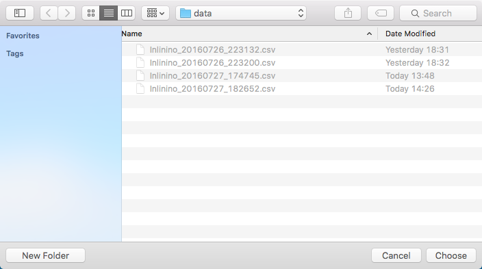
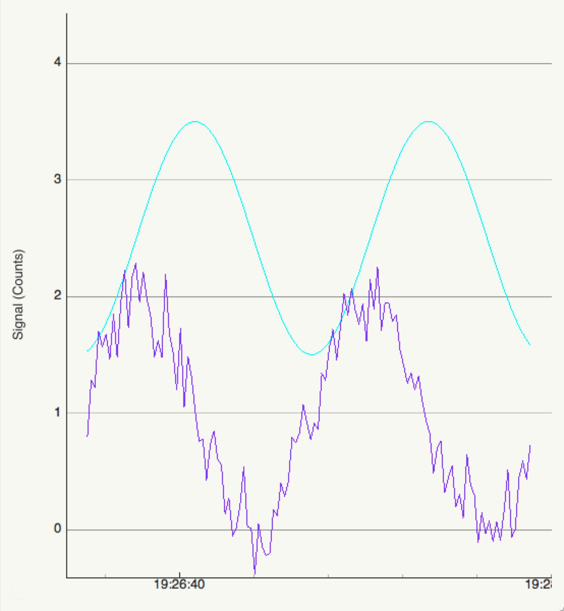
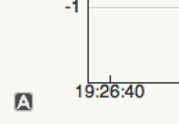
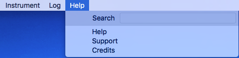

.. _gui:

========================
Graphical User Interface
========================

The purpose of this section is to go through the main functionnality of the graphical user interface also known as GUI.

The GUI is the default interface of Inlinino, if for some reason no windows are openning when you launch inlinino check that the :ref:`configuration <cfg-application>` is set to use the gui interface, or that there is no errors in your :ref:`configuration files <cfg-common-errors>`.

.. _gui-instruments:

Instruments
===========

This section explains how to connect, disconnect and list the instruments available in Inlinino running with the graphical user interface (GUI).

.. contents:: Table of Contents

Connect
-------
To connect an instrument to the current instance two methods are available: the menu bar (on top) or the side bar (on left). Both are doing exactly the same thing.

.. note::
  Make sure that the instrument is properly connected to the computer and you know which COM Port it is connected to.

Menu Bar Connection
  .. image:: screenshots/mb_instr_connect.png

  Click on: MenuBar > Instrument > Connect

  .. image:: screenshots/pu_instr_connect_select.png

  A pop-up will ask for which instrument you want to connect select the appropriate instrument and click on ``[Ok]``. Note that you can connect all the instruments at once selecting the option: "All".
  For instruments using a serial port, another pop-up will show up and ask you for the COM port number. Select the correct one and validate your choice clicking on ``[Ok]``.

Side Bar Connection
  .. image:: screenshots/sb_instr_inactive.png

  Click on: button ``[>]`` on the right of the instrument you want to connect.
  For instruments using a serial port a pop-up window will show up and ask for the COM port number. Select the correct one and validate your choice clicking on ``[Ok]``.

  .. image:: screenshots/sb_instr_active.png

  Once the instrument is connected the status of the instrument (on right of the instrument name on the side bar) will switch from [inactive] to [active] on the side bar. The number of packets received (pckt received) will start increasing at the frequency selected in the configuration file.

The status bar will display ``<instrument_name> is connected`` if everything went well. In case of an error during the connection procedure, those would be indicated on the status bar too. The most common mistake is choosing the wrong COM port or the wrong instrument class.

Once the instrument is connected, the figure will start plotting data received and the digital display (top left) will start updating the values (see images below).

.. note::
  You can cancel the procedure at anytime by clicking on the ``[Cancel]`` button, the connection process will be aborted.

.. warning::
  Data is only displayed, no data is recorded. To record data look at the section `Start Logger`__

__ Start_

.. tip::
  Keyboard shortcut
    + on Windows: <Ctrl> + <S>
    + on OSX: <Cmd> + <S>

Disconnect
----------
To disconnect an instrument from the current instance two methods are available as for the connection procedure.

Menu Bar Disconnection
  .. image:: screenshots/mb_instr_disconnect.png

  Click on: MenuBar > Instrument > Disconnect

  .. image:: screenshots/pu_instr_disconnect_select.png

  A pop-up will ask for which instrument you want to disconnect select the appropriate instrument and click on [Ok]. Note that you can disconnect all the instruments at once selecting the option: "All".

Side Bar Disconnection
  .. image:: screenshots/sb_instr_active.png

  Click on: button ``[o]`` on the right of the instrument you want to disconnect.

  .. image:: screenshots/sb_instr_inactive.png

  Once the instrument is disconnected the status of the instrument (on right of the instrument name on the side bar) will switch from ``[active]`` to ``[inactive]`` on the side bar. The number of packets received (pckt received) will stay constant.

.. Note::
  You can cancel the procedure at anytime by clicking on the ``[Cancel]`` button, the disconnection process will be aborted.

.. Warning::
  Data from this instrument stop displaying, but the logger is still running and recording `NaN` values for the instrument stopped. To stop recording data look at the section `Stop Logger`__

__ Stop_

.. tip::
  Keyboard shortcut
    + on Windows: <Ctrl> + <D>
    + on OSX: <Cmd> + <D>

List
----
To list all instruments available in the current instance and their connection status.

  .. image:: screenshots/mb_instr_list.png

  Click on: MenuBar > Instrument > List

.. note::
  This feature is coming from the CLI but is not really useful as all the instruments are already showing up on the sidebar of the GUI.

Adding/Removing
---------------
Instruments are added/removed through the configuration file. Please look at the `configuration section <cfg.html>`__.

.. note::
  Instruments need to be added/removed before starting an instance of Inlinino. The list of instruments available cannot be modified once the instance of Inlinino is started.

.. _gui-logger:

Logger
======

The data logger is the part of Inlinino that collects data from all the instruments connected, timestamp it and save it in a log file. The time stamp is based on the time of the computer and made in the UTC (Zulu time) time zone for easy post processing of data while crossing longitudes during the cruise. Make sure that the clock of your computer is properly set. Any change in time of the computer while logging data may produce unpredicted behaviours as most of the synchronisation processes of Inlinino are based on the computer clock. If you have any suggestion to improve this, we would be very happy to hear them.

This section explains how to log data with Inlinino. Basic functions such as starting the logger, stopping it, choosing the location of logs as well as log files header will be viewed here. For more advance configuration of the data logger please refer to the `configuration section <cfg.html>`.

Start
-----
To start logging data two methods are available: by the menu bar or by the side bar.

Menu Bar Logging
  .. image:: screenshots/mb_log_start.png

  Click on: MenuBar > Log > Start

Side Bar Logging
  .. image:: screenshots/sb_log_inactive.png

  Click on the [Start] button on the Sidebar

Once the logging starts, the ``[Start]`` button will be unclickable and the [Stop] will be clickable. The name of the log file change to the date and time log has started (ex: ``Inlinino_20160709_091020.csv``).

.. note::
  .. image:: screenshots/pu_log_warn_noinstrcon.png

  If all the instruments are inactive (disconnected), a warning will pop-up to ask if you really want to start logging data. `NaN` values will be logged as all instruments are inactive. This feature can be useful if you want to log as soon as an instrument is connected.

  If select ``[No]``, the logger will not start, whereas selecting ``[Yes]`` will start the logger as usual.

.. note::
  Data is logged in the folder specified via `Set Location`_, by default it's logged in the folder specified in the configuration file.

.. tip::
  Keyboard shortcut
    + on Windows: <Ctrl> + <L>
    + on OSX: <Cmd> + <L>

Stop
----
To stop logging data two methods are available: by the menu bar or by the side bar.

Menu Bar Logging
  .. image:: screenshots/mb_log_stop.png

  Click on: MenuBar > Log > Stop

Side Bar Logging
  .. image:: screenshots/sb_log_active.png

  Click on the ``[Stop]`` button on the sidebar

Once the logging stops, the ``[Stop]`` button will be unclickable and the ``[Start]`` button is clickable. The name of the log file changes to ``<header>_YYYYMMDD_HHMMSS.csv``

.. tip::
  Keyboard shortcut
    + on Windows: <Ctrl> + <K>
    + on OSX: <Cmd> + <K>

.. _gui-header:

Set Header
----------
The prefix of the filename in which data is logged can be changed. The default value being the one set in the configuration file.

To change the header value click on: MenuBar > Log > File Header

Set the appropriate prefix for the filename, use only alphanumeric characters [a-z,A-Z,0-9]. Apply change by clicking on the ``[Ok]`` button.

.. Note::
  You can cancel the procedure at anytime by clicking on the ``[Cancel]`` button, the prefix of the filename will not change.

.. Note::
  If the modification is done while data is logging, it will be taken into account when a new log file is created.

.. _gui-location:

Set Location
------------
The location at which data is stored can be changed. The default value being the one set in the configuration file.

.. image:: screenshots/mb_log_filelocation.png

To change the header value click on: MenuBar > Log > File Location

Set the folder in which you would like to record the data and click on ``[Choose]`` to apply the modification.

.. Note::
  You can cancel the procedure at anytime by clicking on the ``[Cancel]`` button, the location of the log files recorded will not change.

.. Note::
  If the modification is done while data is logging, it will be taken into account when a new log file is created.

.. tip::
  Keyboard shortcut
    + on Windows: <Ctrl> + <J>
    + on OSX: <Cmd> + <J>

Advance configuration
---------------------
Parameters included in the list below can be modified in the :ref:`cfg-log` section.
  + frequency: Frequency at which data is logged (in Hertz)
  + interval_write: Interval at which data is written on the hard drive (in seconds), this is useful in case of power failure, only the last few minutes would be lost and not the entire file.
  + length: Length of log files (in minutes), time after which a new log file is created.
  + header: Default prefix of the filename of the logs.
  + path: Default location to save logs.

Figure
======
The figure is updated in close to real-time (on the right of the window). It's the most intense part of the code in terms of computation requirements.

Freeze
------
The checkbox at bottom of the sidebar allow to freeze the figure to look at it or just to reduce CPU usage of the software if many variables are logged.

.. note::
  Data is still logged normally in the background if the figure is frozen.

Y-Zoom
------
It's possible to zoom in/out on the y-axis of the figure by using the scrolling wheel of your mouse when the cursor is on top of the figure.

Y-Position
----------
It's possible to move the graph on the y-axis by holding down the left button of the mouse and moving the cursor up or down.

.. note::
  Combine with the Y-Zoom this feature allow to look at the details of a specific curve.

Auto
----

In order to reset the setting of Y-axis to "auto", you can click on the ``[A]`` button at the bottom left of the figure, note that the icon will appear only if your cursor is on top of the graph and the Y-axis is not already set to "auto".

Help
====

A quick help is located in the menu bar. Support information as well as credits are available there too.

.. note::
  On OSX, a search field appears too. It can help to find a feature in the menu bar. This element is added automatically by the OS.