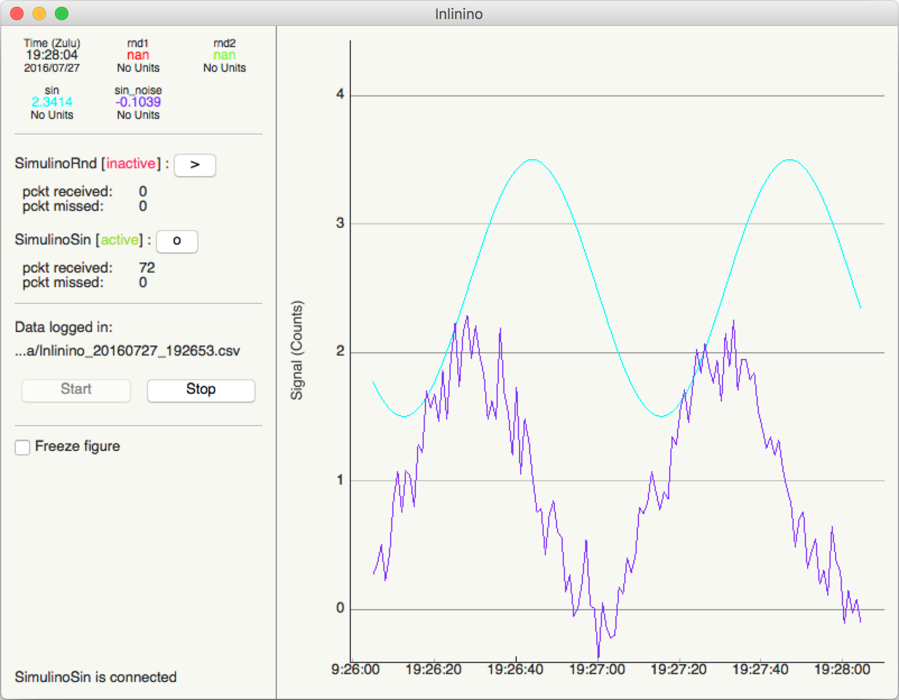

Welcome to Inlinino's documentation!
====================================

Inlinino is a simple data logger. It was developed to log measurments from scientific instruments during extended periods of time (months) but can be used or adapted to your need. It supports any instrument with serial or analog interface as long as there is an API for it or you can make one.

Few instruments from WETLabs are implemented and have been extensively tested during cruises: ECO-BB3, ECO-BB9, and WSCD. To log signal from analog instruments an Arduino, or an ADS-1X15 interface are available.

The configuration of the software is mostly done with json files but some instruments will require adding some python class (just basic coding notions are needed, we keep it simple).

Data recorded by Inlinino is saved hourly (by default) in csv files. Post processing can be done through the software it-self (after updating the code) or with any data analysis tools such as Python, R, or Matlab.

There are two interfaces available to date: a friendly `Graphical User Interface <gui.html>`__ also known as a `GUI <gui.html>`__ (default) and a `Command Line Interface (CLI) <cli.html>`__ for use on servers or power use.

The software is written in python 3+, on top of pySerial and numpy. The GUI is based on PyQt. The software was tested on both Windows 7 and OSX.

Index
^^^^^
.. toctree::
   :maxdepth: 2

    Quick Start<quick_start>
    Installation<install>
    Configuration<cfg>
    Graphical User Interface (GUI)<gui>
    Command Line Interface (CLI)<cli>
