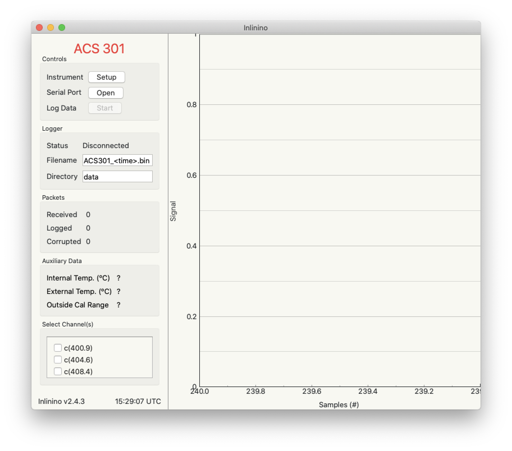

Welcome to Inlinino
===================

Inlinino is an open-source software data logger for oceanographers. It primarily records measurements from optical instruments deployed on research vessels during month long campaigns. It provides real-time visualization, which helps users troubleshoot instruments in the field and ensure collection of quality data. Inlinino can interface with either analog, serial, USB, or UDP instruments. The data received is logged in a timestamped raw format (as communicated by the instrument) or in a comma separated file (csv) for easy importation in data analysis software. Typically, a new log file is created every hour for simplicity of post-processing and easy backups. Instruments supported are: Sea-Bird Scientific ACS, Sequoia HyperBB, Sequoia LISST100x, SeaBird TSG (SBE-45 + SBE-38), Biospherical Instruments Inc. PAR, Sea-Bird Scientific ECO sensors (e.g. ECO-BB3, ECO-FLBBCD, ECO-BB9), Satlantic (now SBS) instruments (e.g. HyperOCR, HyperPro, HyperSAS, HyperNAV, Suna), NMEA over serial or UDP, analog sensors via data acquisition systems (Ontrak ADU100, DataQ DI-1100, and DI-2108), and peripheral control (e.g. pump, 3-way valves) via relay interface (Ontrak ADU100, ADU200, and ADU208). Other serial instruments with ascii output can be configured with the user interface. Instruments with non-trivial output can be added by writing a dedicated python module. The Inlinino software is presented in Haëntjens and Boss 2020 (`DIY Oceanography <https://doi.org/10.5670/oceanog.2020.112>`_).

Index
^^^^^
.. toctree::
   :maxdepth: 2

    Quick Start<quick_start>
