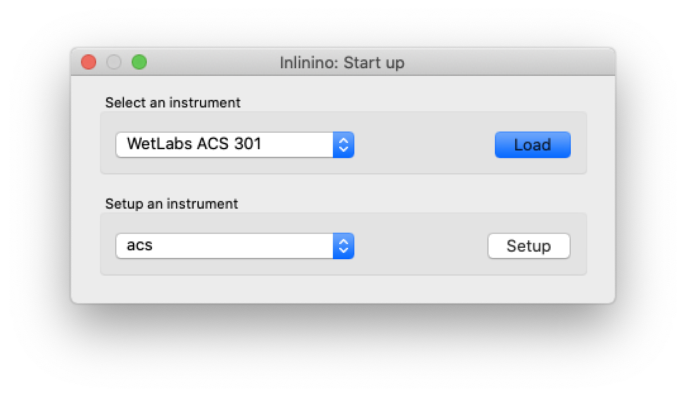
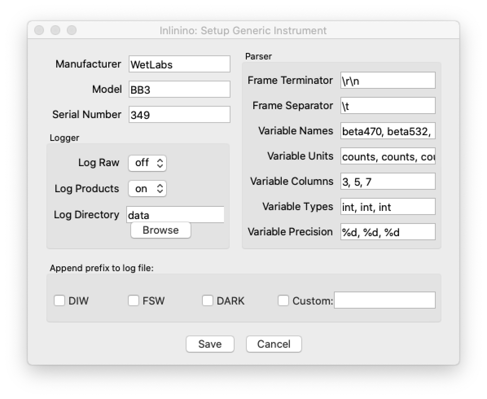
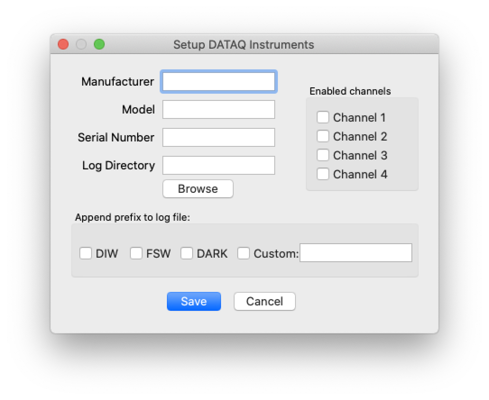
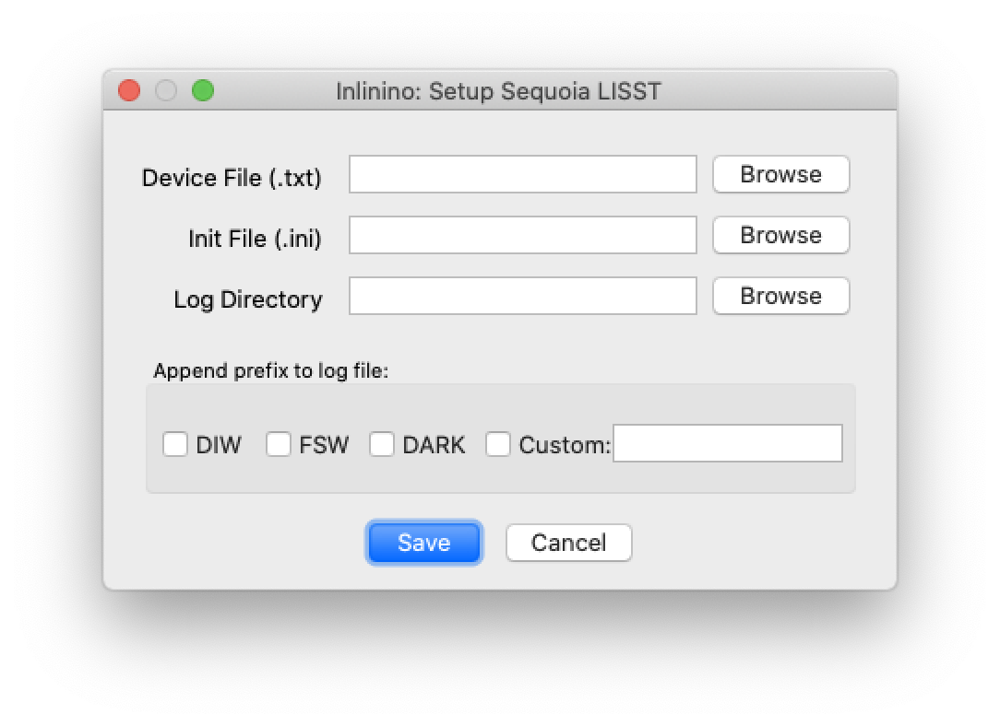
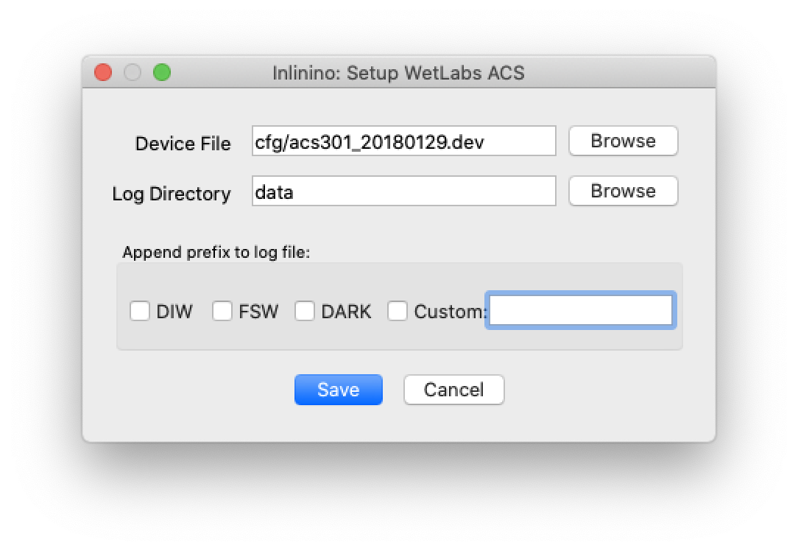
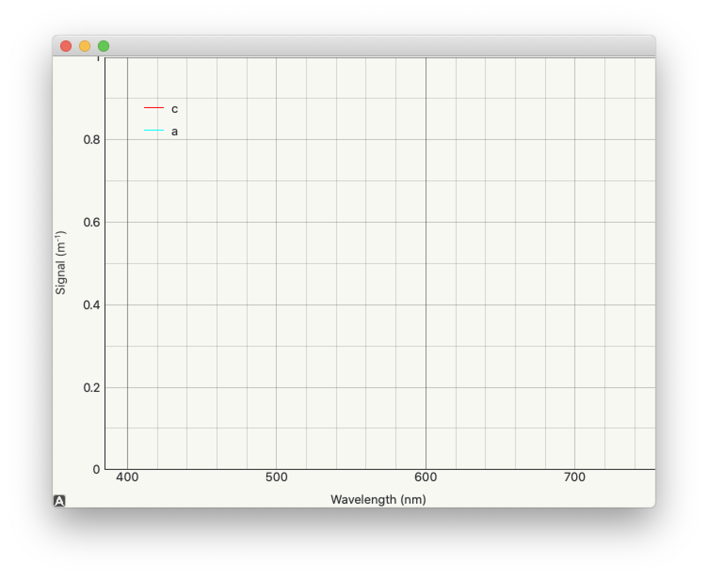

.. _quick-start:

===========
Quick Start
===========

.. |link-to-ftp| raw:: html

    <a href="https://misclab.umeoce.maine.edu/software/Inlinino/Inlinino-v

.. |end-link-win| raw:: html

    -windows.zip">Windows</a>

.. |end-link-win7| raw:: html

    -windows7.zip">Windows 7</a>

.. |end-link-mac| raw:: html

    -darwin.zip">macOS (Intel)</a>

Inlinino is available for Windows and macOS, the packaged executable can be downloaded with the links below.

    + |link-to-ftp|\ |release|\ |end-link-win|
    + |link-to-ftp|\ |release|\ |end-link-mac|

Advance users or developers can setup the software directly from source (`GitHub Repository <https://github.com/OceanOptics/Inlinino/>`__).

.. contents:: Table of Contents

Startup Menu
------------
To start Inlinino double click the executable: Inlinino-v\ |release|.exe on Windows and Inlinino-v\ |release|.app on macOS. When starting the software for the first time, it might take several seconds before displaying a window. Inlinino will first prompt which instrument will it be logging data from (:ref:`Screenshot 1<qs-figure-startup>`). Two options are available:

    + Setup a new instrument:

        1. Select the type of instrument to configure, the type of instrument available are listed in :ref:`Table 1<qs-table-instr-supported>`.
        2. Click on the setup button on the right side.
        3. A pop-up window will prompt you to configure the instrument, instructions for each type of instruments are available in the following sections.
        4. After validating the configuration of the instrument the main Inlinino window will be loaded.

    + Load a previously configured instrument:
        1. Select the instrument from the dropdown menu.
        2. Click on the load button on the right side.
        3. The main Inlinino window will be loaded for the selected instrument.

.. _qs-table-instr-supported:
.. table:: Table 1. Instruments supported

    ======================================  ============================
      Instrument type                         Instrument supported
    ======================================  ============================
       :ref:`acs<qs-setup-acs>`              Sea-Bird Scientific AC-S
       apogee                                Apogee Instruments PAR Sensor (SQ-522-SS)
       :ref:`dataq<qs-setup-dataq>`          | DATAQ DI-1100
                                             | (Data Acquisition Interface for analog sensors)
       hyperbb                               Sequoia HyperBB
       hypernav                              Sea-Bird Scientfic HyperNav
       :ref:`lisst<qs-setup-lisst>`          Sequoia LISST
       nmea                                  Read & Parse NMEA over Serial or UDP
       ontrak                                | Ontrak Control Systems ADU100, ADU200, and ADU208
                                             | (supports Flow control, Flowmeter, & DAQ for Analog sensors)
       satlantic                             | Satlantic Instruments (e.g. HyperOCR, HyperPro, HyperSAS, Suna)
                                             | Requires Instrument's Telemetry Definition or Calibration Files
       suna                                  Satlantic Suna V1 and V2
       :ref:`generic<qs-setup-generic>`      | Any sensor outputting text over serial
                                             | (e.g. :ref:`Sea-Bird Scientific ECO-Triplets<qs-figure-setup-generic-bb3>`, BioSpherical PAR, SeaBird TSG)
    ======================================  ============================

.. _qs-figure-startup:

  Screenshot 1. Inlinino Start up window

.. _qs-setup-generic:

Setup a generic instrument
^^^^^^^^^^^^^^^^^^^^^^^^^^
Instruments are considered as generic if they send data as structured ascii frame. The frame is considered structured when each variable is separated by a separator (e.g. comma, tabulation) and the frame terminate with a terminator (e.g. carriage return). An example on how to fill the form for a Sea-Bird Scientific ECO-BB3 is given in the :ref:`Screenshot 2<qs-figure-setup-generic-bb3>`.

``General section <top left>``
  The manufacturer, model, and serial number of the instruments must be entered at the top left of the window.

``Logger Group-Box <middle leftt>``
  It's possible to log the data in different format (select one or both options):

    + `raw data`: exact output of the instrument to which a timestamp is appended
    + `products`: variables of interest are extracted from the data frame received from the instrument and formatted into a comma separated value (csv) file with a timestamp.

  The folder in which the data is logged is specified in the field `Log Directory`. The button `Browse` can be used to easily browse the computer file system and choose the adequate directory.

``Parser Group-Box <left>``
    + `Frame Terminator`: indicate the end of the frame, hence the beginning of the next frame. Typically `\r\n` or `\n`.
    + `Frame Separator`: element separating values in frame. Typically `,` or `\t`.
    + `Variable Names`: list of variable names separated by commas.
    + `Variable Units`: list of variable units separated by commas.
    + `Variable Columns`: list of position of each variable in the frame.
    + `Variable Types`: list of type of each variable. Can either be a floating number (`float`) or an integer (`int`).
    + `Variable Precision`: list of string format used for each variables to write product log file. Typically `%d` for integers and `%.3f` for floating number with a precision of 3 decimal places.

    .. note::
      Variable Names, Variable Units, Variable Columns, Variable Types, and Variable Precision must be lists containing the same number of elements. All elements are separated by commas. Spaces are ignored. Special characters are not permitted.

    .. note::
      Note that the software record the date and time at which it received each data frame, hence no need to record the instrument timestamp which often drifts significantly during month long campaigns and is rarely set properly.

Below is an example of two data frames received from a Sea-Bird Scientific ECO-BB3 to illustrate this settings. Each variable is separated by a tabulation (`\t`). The column 2, 4, and 6 correspond to the wavelengths of the sensor (note that the indexing start at 0 not 1). The column of interest with values corresponding to each one of the wavelength are 3, 5, and 7 (e.g. 255, 244, and 232 for the first frame). An example of variable names could be: beta470, beta532, and beta650. The variable units are: counts, counts, and counts in this case. Frames are separated by a new line character (`\r\n`). The date, time, and checksum (last number) would be ignored in these case. The  :ref:`Screenshot 2<qs-figure-setup-generic-bb3>` shows how to fill the form for this instrument and the data frames in question.::

    11/08/16	20:33:49	470	255	532	244	650	232	524
    11/08/16	20:33:50	470	263	532	251	650	237	588

``Append prefix to log file Group-Box <left>``
  This group-box is common to every instrument and explanations are provided in the section :ref:`Edit Instrument Configuration<qs-edit-instrument-configuration>`.

.. _qs-figure-setup-generic-bb3:

  Screenshot 2. Inlinino generic instrument setup window prefilled for a Sea-Bird Scientific ECO-BB3

.. _qs-setup-analog:

Setup an analog instrument
^^^^^^^^^^^^^^^^^^^^^^^^^^
Data acquisition system (DAQ) are required to read and log data from analog instruments. Supported DAQ include:
    + :ref:`DataQ DI-1100<qs-setup-dataq>` and DI-2108
    + Ontrak ADU100

.. _qs-setup-dataq:

DataQ DI-1100
"""""""""""""
``General section <top left>``
  The manufacturer, model, and serial number of the instruments must be entered at the top left of the window. Special character are not supported and space will be ignored.

  The folder in which the data is logged is specified in the field `Log Directory`. The button `Browse` can be used to easily browse the computer file system and choose the adequate directory.

``General Group-Box <top right>``
  Select the channels from DataQ DI-1100 from which instruments are connected and tension (in Volts) will be recorded. Unchecked channels will be disregarded (no data logged).

    .. note::
      Selecting less channels increase the subsampling frequency (indirectly increasing the sampling resolution). Typically this DAQ is set to average all subsamples and log this average at 1 Hz.

``Append prefix to log file Group-Box <left>``
  This group-box is common to every instrument and explanations are provided in the section :ref:`Edit Instrument Configuration<qs-edit-instrument-configuration>`.

.. _qs-figure-setup-dataq:

  Screenshot 3. Inlinino DataQ DI-1100 setup window for analog instruments

.. _qs-setup-lisst:

Setup a Sequoia LISST
^^^^^^^^^^^^^^^^^^^^^
Setting up the Sequoia LISST instrument is straightforward as all settings are contained in the manufacturer's device file (.txt) and the initialization file (.ini). The `browse` button on the right side of each field can be used to locate this files on the computer. Both of these files are required.

The folder in which the data is logged is specified in the field `Log Directory`. The button `Browse` can be used to easily browse the computer file system and choose the adequate directory.

``Append prefix to log file Group-Box <left>``
  This group-box is common to every instrument and explanations are provided in the section :ref:`Edit Instrument Configuration<qs-edit-instrument-configuration>`.

.. _qs-figure-setup-lisst:

  Screenshot 4. Inlinino setup window for a Sequoia LISST

.. _qs-setup-acs:

Setup a Sea-Bird Scientific AC-S
^^^^^^^^^^^^^^^^^^^^^^^^^^^^^^^^
Setting up a Sea-Bird Scientific AC-S or AC-9 is simple as all settings needed are provided by the manufacturer in the device file (.dev). This file can be located on the computer with the `browse` button on the side of the Device File field.

The folder in which the data is logged is specified in the field `Log Directory`. The button `Browse` can be used to easily browse the computer file system and choose the adequate directory.

``Append prefix to log file Group-Box <left>``
  This group-box is common to every instrument and explanations are provided in the section :ref:`Edit Instrument Configuration<qs-edit-instrument-configuration>`.

.. _qs-figure-setup-acs:

  Screenshot 5. Inlinino setup window for a Sea-Bird Scientific AC-S

Main Window
-----------
Once an instrument selected or setup through the startup window, the main Inlinino window will be loaded. The model and serial number of instrument will be displayed at the top of the sidebar. The color of the instrument's model and serial number indicates the current status of the system:

    + red: the instrument is not connected
    + orange: the instrument is connected but not logging
    + green: the instrument is connected and logging data

To log data follow the steps describe in the following section (:ref:`Log Data<qs-log-data>`).

To log data from multiple instruments simultaneously, start multiple instances of Inlinino. To do so, simply click on the Inlinino executable icon (.app on macOS or .exe on Windows) as many times as instruments to log. On the startup  window select the appropriate instrument each time.

The last 120 values of selected channels are displayed in the plotting section of the main window (:ref:`Figure 7<qs-figure-main-window>`) once the instrument is connected. On generic and analog instruments all channels are selected. On the Sea-Bird Scientific ACS and Sequoia LISST the user can select the channels of interest from the ``Select Channel(s)`` Group-Box menu at the bottom of the sidebar. By default, the latest channels selected by the users are plotted.

The ``Packets`` Group-Box of the sidebar displays in real-time the number of packets received, logged, and corrupted. When an instrument is turned on a few corrupted packets could be received, they are generally due to the instruments initialization message. If the number of corrupted packets keep increasing, a problem with the data format, the instrument settings, or the connections is occurring. Note that if the raw data is logged, the corrupted packets are logged but not timestamped. The raw data logging option is available in the setup menu of generic instruments. For other instrument types it's activated by defaults.

Instruments with many channels like the Sea-Bird Scientific AC-S and Sequoia LISST have an auxiliary window (:ref:`Figure 8<qs-figure-aux-window>`) which shows the latest value received of each channel. Instruments communicating auxiliary data (e.g. instrument temperature) have it displayed in the ``Auxiliary Data`` Group-Box of the sidebar.

.. _qs-figure-main-window:
.. figure:: screenshots/main_window_acs.png
  :scale: 35 %
  :align: center

  Screenshot 6. Inlinino Main Window

.. _qs-figure-aux-window:

  Screenshot 7. Inlinino Auxiliary window specific to instruments with many channels (e.g. AC-S, LISST)

.. _qs-log-data:

Log data
^^^^^^^^
    1. Verify the configuration of the instrument by clicking on the setup button. Detailled instruction are provided in the, c.f. :ref:`next section<qs-edit-instrument-configuration>`.
    2. Connect the instrument:

        a. Click on ``Open`` button under the ``Controls`` section at the top of the sidebar.
        b. A pop-up window will prompt the serial port to which the instrument  should be connected to.
        c. Once connected the instrument name at the top of the sidebar will change to an orange color, and data can be visualize on the figure section of the window.

    .. warning::
      If no data can be visualized or the data makes no sense, the instrument is either incorrectly configured, their is a problem wih the connection, the instrument has an issue, or the instrument is not sampling properly (e.g. bubbles in the sample).

    3. Log data:

        a. Click on ``Start`` button under the ``Controls`` section at the top of the sidebar.
        b. The name of the instrument will change to a green color. The filename under the ``Logger`` section will be updated to reflect the current file in which the data is logged. The filename is formatted as follow `<prefix><instrument_model><instrument_serial_number>_<YYYYMMDD>_<hhmmss>`. Prefix can be updated from the instrument `setup` (c.f. :ref:`Edit Instrument Configuration<qs-edit-instrument-configuration>`). is Typically, a new file is created hourly, however, this can be adjusted through the configuration file.

.. _qs-edit-instrument-configuration:

Edit instrument configuration
^^^^^^^^^^^^^^^^^^^^^^^^^^^^^
Before logging data, it's important to check the configuration of the instrument, that the variables recorded are correct or that the calibration files are up to date.

To edit the configuration of an instrument, Inlinino must be started with the instrument loaded. Click the ``Setup`` button under the ``Controls`` Group-Box at the top of the sidebar. The setup window will pop-up. To update settings follow instructions specific to each instrument's type (c.f. :ref:`Table 1<qs-table-instr-supported>`).

``Append prefix to log file Group-Box``
    Data filenames follow the syntax ``<instrument_model><instrument_serial_number>_YYYYMMDD_HHMMSS.csv``. For example a file for a Sea-Bird Scientific ACS serial number 301 created July 9, 2016 at 16:01:00 UTC would be named: ``ACS301_20160709_160100.csv``.

    One might want to append a prefix to a data file name logged with Inlinino, in the event of instrument calibration or some experiments. To consistently append a prefix to the name of a file logged with Inlinino, select the prefix desired at the bottom of the setup window (:ref:`Screenshot 8<qs-figure-log-prefix>`).

    .. _qs-figure-log-prefix:
    .. figure:: screenshots/setup_log_prefix.png
      :scale: 50 %
      :align: center

      Screenshot 8. Append prefix to log file name.

    .. warning::
      The ``Append prefix to log file`` settings are only applied to the current Inlinino session and are reset when Inlinino is restarted.
